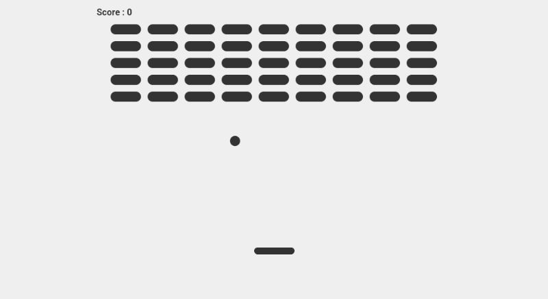

<h1 align="center">Breakout | Game</h1>

Breakout Game é um simples jogo de blocos 

 

  

## 🚀 Tecnologias

Esse projeto foi desenvolvido com as seguintes tecnologias:

- JavaScript 
- HTML 5
- CSS 3
- Git e Github

## 💻 Projeto

Esse jogo tem como principal objetivo treinar os reflexos visuais 
